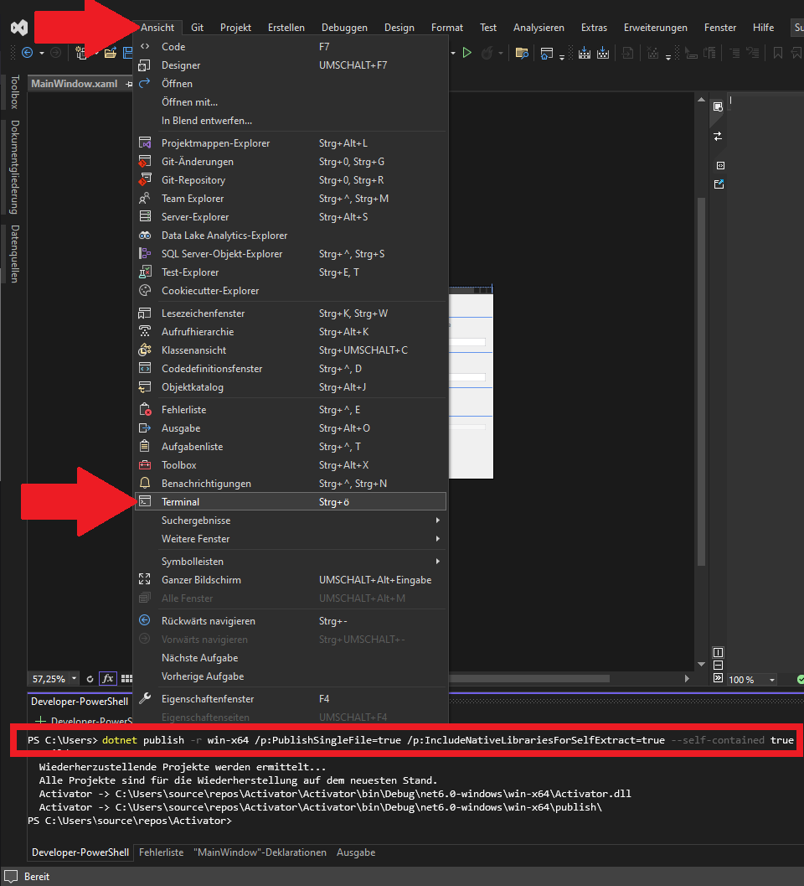

# SelfcontainingC-
Selfcontainng dlls in C#

copy this line to powershell

<pre><code>dotnet publish -r win-x64 /p:PublishSingleFile=true /p:IncludeNativeLibrariesForSelfExtract=true --self-contained true  
</code></pre>

Found @
https://learn.microsoft.com/en-us/answers/questions/296816/self-contained-single-file-does-not-produce-a-sing
